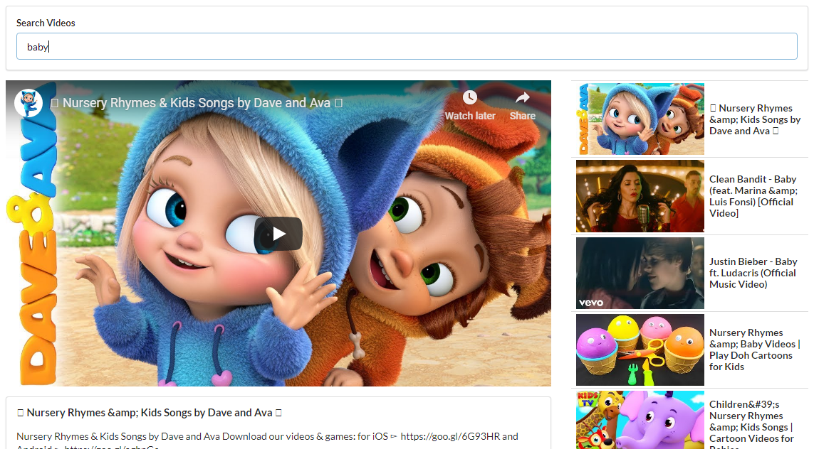

# React Videos
> React application to search and access youtube videos.

    

## Technologies Used
> Javascript, React, Axios, Semantic UI, CSS, HTML5

## Data API
> Fetching video data is done by using [Youtube API](https://developers.google.com/youtube/v3/docs/search/list).